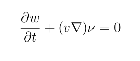

# Лабораторная работа по HPC

## Тема задания: решение дифф. уравнения методом Рунге-Кутты 4 порядка

### Постановка задачи

Дан набор частиц на плоскости `(x[i], y[i], omega[i])`, где `omega` - "закрученность" частицы. 
Решить дифф. уравнение методом Рунге-Кутты 4 порядка. Построить анимацию движения частиц. 

### Использование

Программу можно использовать двумя способами:

    ./m random

или

    ./m initfile h

В первом случае точки сгенерируются случайным образом, с параметрами, указанными в `particles.config`. Во втором случае, точки будут взяты из указанного файла. 

Проект сопровождается `make`-файлом. Вот некоторые команды, которые можно использовать:

1. `make compile` - компилирует программу;
2. `display` - использует `Python3` и запускает скрипт `display.py`;
4. `doc` - компилирует `LaTeX`-отчёт;

Пример:

    make compile
    ./m random
    make display

Или:

    make compile
    ./m data/circle.init
    make display

Результат можно смотреть в видео файле `ani.mp4`.

### Требования

Для компиляции программы необходим компилятор `gcc` (с другими я не пробовал). Чтобы рендерить видео-файл необходим `python3`.