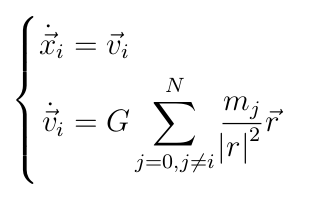

# Лабораторная работа по HPC

## Тема задания: решение дифф. уравнений методом Рунге-Кутты 4 порядка

### Постановка задачи

Дан набор материальных точек, обладающих весом `m`, начальными координатами на плоскости `x` и `y`, а так же начальной скоростью `vx`, `vy`. Методом Рунге-Кутты 4 порядка смоделировать движение точек, под действием Ньютоновских сил притяжения.

### Решение

Составим следующее дифф. уравнение:

где вектор `r` -- единичный вектор, направленный от точки `i` к точке `j`.

Пусть `z = [x, y, vx, vy, m]`, тогда применяем метод Рунге-Кутты 4 порядка:

    k_1 = F(z)
    K_2 = F(z + k_1*h/2)
    k_3 = F(z + k_2*h/2)
    k_4 = F(z + k_3*h)

    z += (k_1 + 2*k_2 + 2*k_3 + k_4)*h/6

Где `F(z)` - правая часть системы.

### Использование

Программа требует аргументом имя инициализационного файла, целое число (количество последовательных решений, то есть кадров анимации), а так же шаг `h` (рекомендованный шаг - `0.0001`).
Формат инициализационного файла следующий:

    N
    x_1 y_1 vx_1 vy_1 m_1
    ...
    x_N y_N vx_N vy_N m_N

1. Нужно скомпилировать программу командой `make compile`;
2. Запустить расчёт;

  * Если запускаете на домашнем компьютере с использованием OpenMP: `./m init_file turns h`, не забудьте установить количество потоков через переменную окружения `OMP_NUM_THREADS`, например `export OMP_NUM_THREADS=4`;

  * Если запускаете на домашнем компьютере, с использованием MPI: `mpirun -np P m init_file turns h`, где `P` - количество процессоров (потоков на домашнем комрьютере);

  * На кластере используйте предложенный планировщик задач;
3. Программа выдаст файл `data/timeline.data`, для того чтобы она смогла создать файл, создайте папку `data` в рабочей директории;
4. Запустите `make display`, если у вас установлен `python3` и соответствующие пакеты, `matplotlib` и кодек для рендеринга видео.
